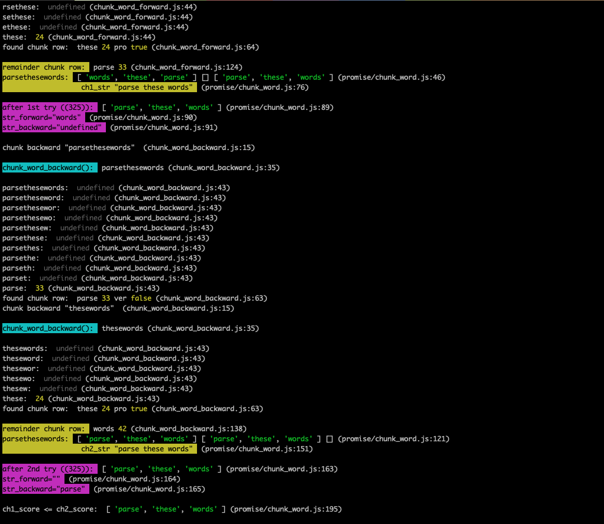

# Add color to your console messages

No dependencies. No setup required. Easily integrate with Cloud logging (LogDNA, etc). Visually group similar types of logs in the terminal. Show a concise file/line trace for each message - so you can actually find where it's originating without looking through the entire codebase. More coming soon.



Works on both Node.js and in Browser. Colors do not work inside IDEs like CodePen.io. Scroll down for browser usage. This is code still experimental and will change until `version 1`. Do **not** install `@latest`, but stick to a well-tested current version.

This package is exported as CJS (CommonJS) by default. To use ESM (ES Modules), just append `.mjs` extension after the filename. If filename is not specified, use `index.mjs`.

[](https://www.npmjs.com/package/colorful-console-logger)


##

# Use in Node.js - ESM (ES Modules)

### 1. Import it:

```
const cconsole = require('colorful-console-logger/cconsole');
```

Name it to whatever you want (`konsole`, `consola`, `consolee`)


### 2. Use it:

```
cconsole.time();
cconsole.clear();
cconsole.log('no special colors');
cconsole.info('light blue (teal/aqua) background');
cconsole.warn('this is a warning, yellow/orange background');
cconsole.error('Error: bright red background, yellow text');
cconsole.trace('TEST log trace');
cconsole.error(new Error('TEST log error'));
cconsole.table([[1, 2, 3, 4, 5], ['a', 'b', 'c', 'd', 'e']]);
cconsole.timeEnd();
```

### 3. Advanced usage:

```
const cconsoleInit = require('colorful-console-logger/cconsoleInit');
// require('colorful-console-logger') gets the same thing

// use it anywhere
globals['cconsole'] = cconsoleInit({
  useTrace: true, // show file and line-number where the console was called from
  useColor: true, // add a splash of color, to find the info, warn, or debug more easily
  separateTypes: true, // put a space between groups of similar types (logs, infos, warns)
  logToCloud: {
    log: customCloudLogFunction,
    info: customCloudInfoFunction,
    warn: customCloudWarnFunction,
    error: customCloudErrorFunction
  }
})
```


##

# Use in browser


## Auto-init with default options:

### 1. Import it:
```
<script src="https://raw.githubusercontent.com/paulshorey/colorful-console-logger/main/dist/cconsole.js"></script>
<!-- this script will add window.cconsole variable to your webpage -->
```

### 2. Use it:
```
cconcole.info('this message will have background light blue')
cconcole.warn('this message will have background yellow')
cconcole.error('this message will have background red with yellow text')
```

### 3. Advanced usage:

```
<script src="https://raw.githubusercontent.com/paulshorey/colorful-console-logger/main/dist/cconsoleInit.js"></script>
<!-- this script will add window.cconsoleInit variable to your webpage -->

const cconsole = cconsoleInit({
  useTrace: true, // show file and line-number where the console was called from
  useColor: true, // add a splash of color, to find the info, warn, or debug more easily
  separateTypes: true, // put a space between groups of similar types (logs, infos, warns)
  logToCloud: {
    log: customCloudLogFunction,
    info: customCloudInfoFunction,
    warn: customCloudWarnFunction,
    error: customCloudErrorFunction
  }
})

cconcole.info('this message will have background light blue, and will log to your cloud provider')
```


# About

Made by Paul for projects listed on PaulShorey.com, for future projects, for future clients and employers, for everyone. This is a work in progress.
